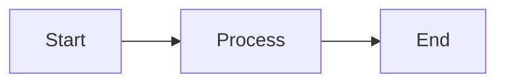
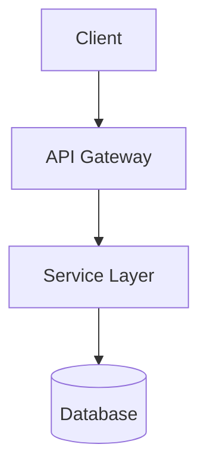

# Output Format: Obsidian Markdown

All output MUST use Obsidian-flavoured Markdown, leveraging its extended syntax for maximum utility in the vault.

## Key Syntax Rules

### Links
- **Wikilinks (preferred):** `[[Page Name]]` or `[[Page Name|display text]]`
- **External links:** `[text](https://example.com)`
- **Heading links:** `[[Page Name#Heading]]`
- **Block links:** `[[Page Name#^block-id]]`

### Embeds
- **Embed note:** `![[Page Name]]`
- **Embed section:** `![[Page Name#Heading]]`
- **Embed image:** `![[image.png]]` or `![[image.png|400]]` (with width)

### Tags
- Inline: `#tag` or `#tag/subtag`
- In frontmatter: `tags: [tag1, tag2]`

### Callouts
Use Obsidian's callout syntax (renders as styled boxes):

```markdown
> [!note]
> This is a note callout.

> [!tip]
> This is a tip callout.

> [!warning]
> This is a warning callout.

> [!danger]
> This is a danger/critical callout.

> [!info]
> This is an info callout.

> [!question]
> This is a question/FAQ callout.
```

Callouts can be **foldable**:
```markdown
> [!tip]- Click to expand
> Hidden content here.
```

### Frontmatter
Always include YAML frontmatter for metadata:
```yaml
---
tags: [project, active]
created: 2026-01-29
status: draft
---
```

### Task Lists
- `- [ ]` Unchecked task
- `- [x]` Completed task
- `- [/]` In progress (with Tasks plugin)
- `- [-]` Cancelled (with Tasks plugin)

### Code Blocks
Use fenced code blocks with language hints:
````markdown
```python
def example():
    return "hello"
```
````

### Diagrams (Mermaid)
Obsidian renders Mermaid natively:
````markdown

````

### Tables
Standard Markdown tables work:
```markdown
| Column A | Column B |
|----------|----------|
| Value 1  | Value 2  |
```

## Example Output

```markdown
---
tags: [meeting-notes, project-alpha]
created: 2026-01-29
---

# Project Alpha Sync

## Summary

Discussed the [[Technical Design Doc]] and agreed on next steps.

> [!tip]
> See [[Meeting Notes/2026-01-22]] for prior context.

## Action Items

- [ ] @allan Finalise the [[PRD]] by Friday
- [ ] @team Review the #architecture proposal
- [x] Completed stakeholder alignment

## Architecture Overview



## References

- [[Project Alpha/Index]]
- [[03. Resources/Templates/PRD Template]]
```